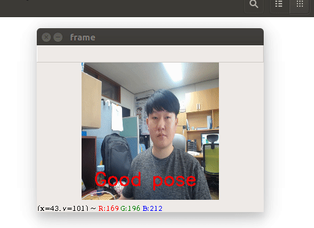

# Right Pose Classification
Developing classification model to distinguish right sitting pose from bad pose.

컴퓨터 앞에서 장시간 일하는 사람은 목 통증과 어깨 결림을 경험하기 쉽습니다. 모니터를 향해 목을 내밀고 상체를 구부리는 자세는 ‘거북목 증후군(Cervical  Hypolordosis syndrome)’으로 이어지기도 합니다. 거북목 증후군은 목뼈의 형태가 변형되어 목, 어깨, 등에 통증을 유발합니다.

최근 많은 연구자, 기업, 일반인들이 한층 대중화된 머신러닝, 딥러닝 프레임워크를 이용하여 데이터 기반으로 당면한 문제를 풀려고 하고 있습니다.

저도 이런 흐름에 맞춰 거북목 자세를 감시하기 위한 토이 프로젝트를 진행하기로 했습니다. 

I define right pose and bad pose like this : 

# Demo

